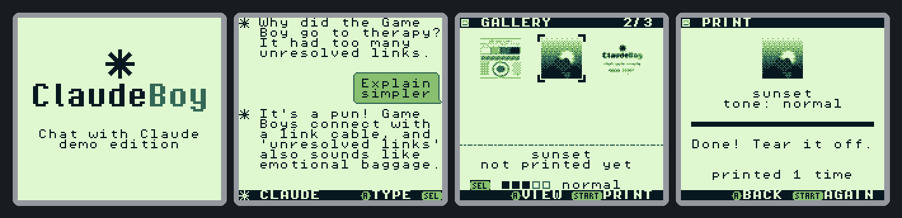
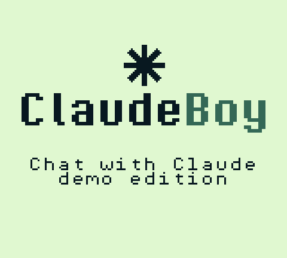
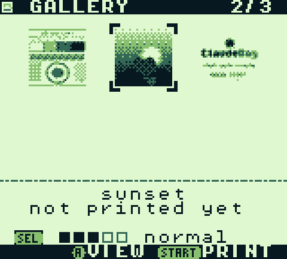
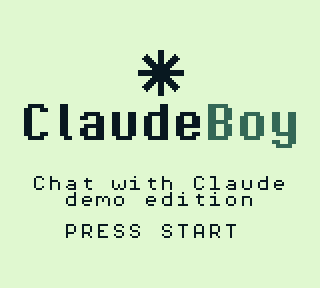
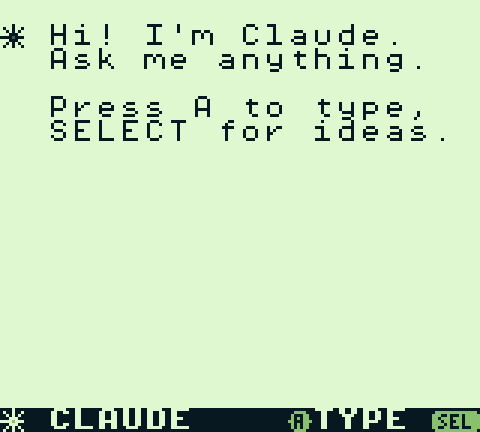
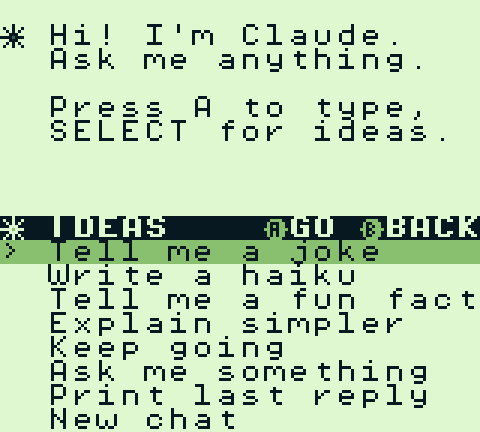
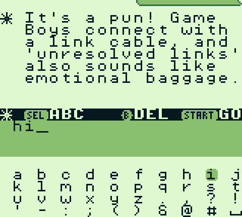
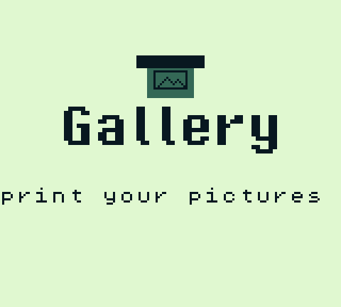
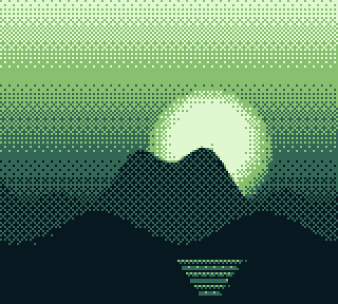
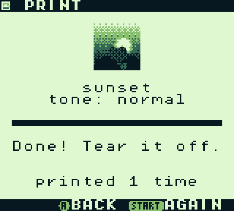

<p align="center">
  
</p>

<h1 align="center">Game Boy Lab</h1>

<p align="center">
  Homebrew for the original Game Boy that runs on real hardware.<br>
  Chat with Claude, print your pictures, and follow along as it gets built.
</p>

<p align="center">
  <a href="https://github.com/hazy2go/gameboy-lab/releases/latest"><b>Download ROMs</b></a> ·
  <a href="https://github.com/hazy2go/gameboy-lab/discussions/categories/announcements"><b>Devlog</b></a> ·
  <a href="docs/hardware.md"><b>Hardware</b></a> ·
  <a href="#build-from-source"><b>Build</b></a>
</p>

<p align="center">
  
  
  
  
</p>

---

## Projects

| | Project | What it does | Status |
|---|---|---|---|
|  | **[ClaudeBoy](claudeboy/)** | Chat with Claude on a Game Boy: on-screen keyboard, streaming replies, chat bubbles, and printouts of your conversation on the Game Boy Printer. | **Demo ROM:** ready to play.<br>**Live ROM:** works in the emulator; the link-cable bridge hardware is [being built](docs/hardware.md). |
|  | **[GB Gallery](gallery-printer/)** | A photo gallery cartridge: drop pictures in a folder, browse thumbnails, view them full screen, print them. | Printed on a real Game Boy Printer.<br>The new thumbnail UI is tested in the emulator. |

### ClaudeBoy

<p align="center">
  
</p>

The Game Boy is the terminal. A Raspberry Pi Pico on the link cable passes bytes
to a Mac, the Mac asks Claude and lays the reply out as tiles, and it streams
back word by word. Your messages are speech bubbles, Claude's replies get a ✳,
and START prints the exchange on a paper strip. The chat is saved on the
cartridge, so it survives power-off.

The **demo ROM** needs none of that: it has preset replies built in, so it runs
on any Game Boy or emulator by itself. The quick-menu ideas (jokes, haiku, fun
facts, "explain simpler", "keep going") all have answers.

<p align="center">
  
  
  
</p>

→ [Read more](claudeboy/) · [wiring and shopping list](claudeboy/README.md#shopping-list)

### GB Gallery

Turns a folder of pictures into a cartridge. The converter crops each picture to
160×144 and dithers it to 4 greys in the Game Boy Camera's crosshatch style.
The ROM shows a thumbnail grid and streams any picture straight from ROM to the
printer. Print counts and the print tone are saved on the cart.

<p align="center">
  
  
  
</p>

→ [Read more](gallery-printer/)

## Play them

1. Grab the `.gb` files from the [latest release](https://github.com/hazy2go/gameboy-lab/releases/latest).
2. **Real Game Boy:** copy them to a flash cart. Everything here is developed on an
   EverDrive; saves use standard MBC5 cart RAM (battery or FRAM).
3. **Emulator:** any Game Boy emulator works. [SameBoy](https://sameboy.github.io/)
   also emulates the Game Boy Printer.

## Hardware

Everything is built and tested for a real DMG Game Boy, an EverDrive and the
Game Boy Printer. ClaudeBoy's live mode adds a small link-cable bridge
(Raspberry Pi Pico + level shifter). The parts list, wiring, and build progress
are on the **[hardware page](docs/hardware.md)**.

## Progress

- **Devlog:** updates on the ROMs and the hardware are posted in
  [Discussions → Announcements](https://github.com/hazy2go/gameboy-lab/discussions/categories/announcements).
  Watch the repo (Custom → Discussions) to get them.
- **Show and tell:** each project has its own thread in
  [Discussions → Show and tell](https://github.com/hazy2go/gameboy-lab/discussions/categories/show-and-tell),
  with questions and feedback welcome there.
- **Changelog:** [DEVLOG.md](DEVLOG.md) keeps the same history in the repo.

### Roadmap

- [x] GB Gallery: convert, browse, print, save print counts
- [x] GB Gallery: thumbnail grid UI
- [x] ClaudeBoy: chat UI, keyboard, printing, saved chat
- [x] ClaudeBoy: Mac bridge (Claude subscription via Claude Code, or the API)
- [x] ClaudeBoy: standalone demo ROM
- [ ] ClaudeBoy: build the Pico link bridge and test on real hardware
- [ ] ClaudeBoy: Wi-Fi bridge (Pico W), no Mac needed
- [ ] GB Gallery: long prints (pictures taller than one screen)

## Build from source

You need [GBDK-2020](https://github.com/gbdk-2020/gbdk-2020) (the Makefiles look in
`~/gbdk`; override with `make GBDK=/path`) and Python 3 with Pillow.

```sh
make -C claudeboy            # build/claudeboy.gb (live)
make -C claudeboy demo       # build/claudeboy-demo.gb
make -C claudeboy emu        # play it on a Mac, with real Claude replies
make -C gallery-printer      # build/gallery.gb from gallery-printer/images/
make -C claudeboy test       # headless end-to-end tests (PyBoy)
make -C gallery-printer test
```

```
claudeboy/         ClaudeBoy: ROM (src/), Mac bridge (bridge/), Pico firmware (pico/), demo replies (tools/)
gallery-printer/   GB Gallery: ROM (src/), picture converter and UI tiles (tools/), sample pictures (images/)
docs/              hardware notes and README media
scripts/           regenerates docs/media from the real ROMs
```

## License

Code is [MIT](LICENSE). The pixel fonts are PixelOperator by Jayvee Enaguas
([CC0](claudeboy/tools/fonts/LICENSE.txt)).

A fan project, not affiliated with or endorsed by Nintendo or Anthropic.
Game Boy is a trademark of Nintendo; Claude is a trademark of Anthropic.
